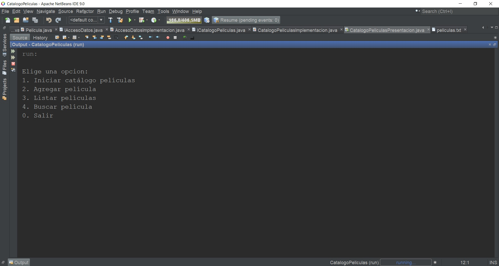
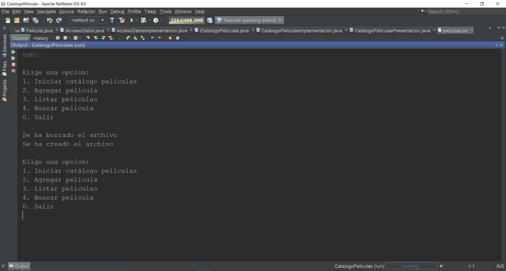
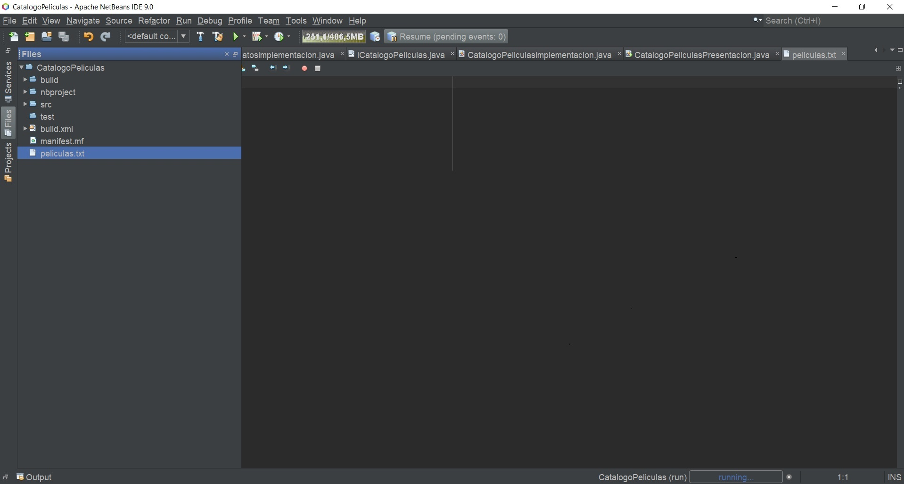
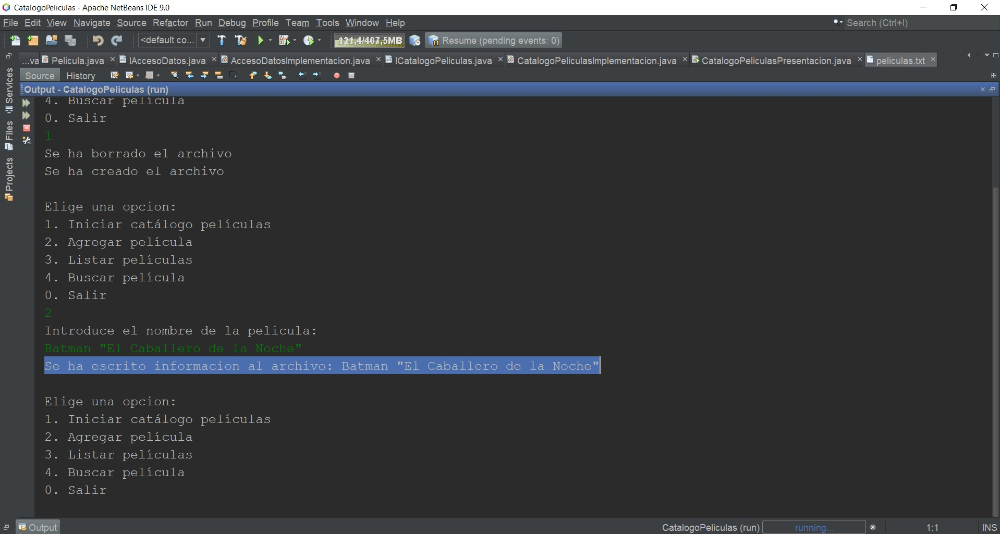
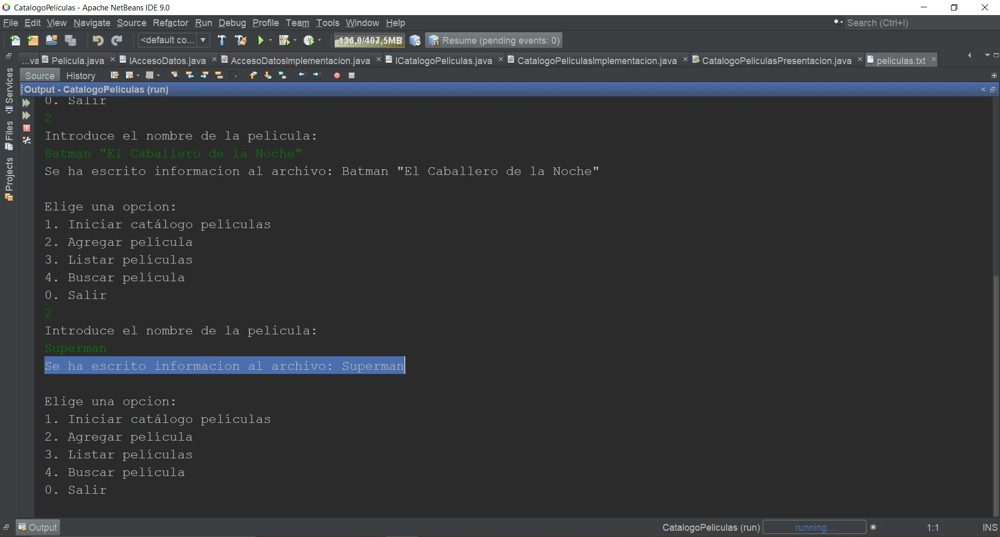
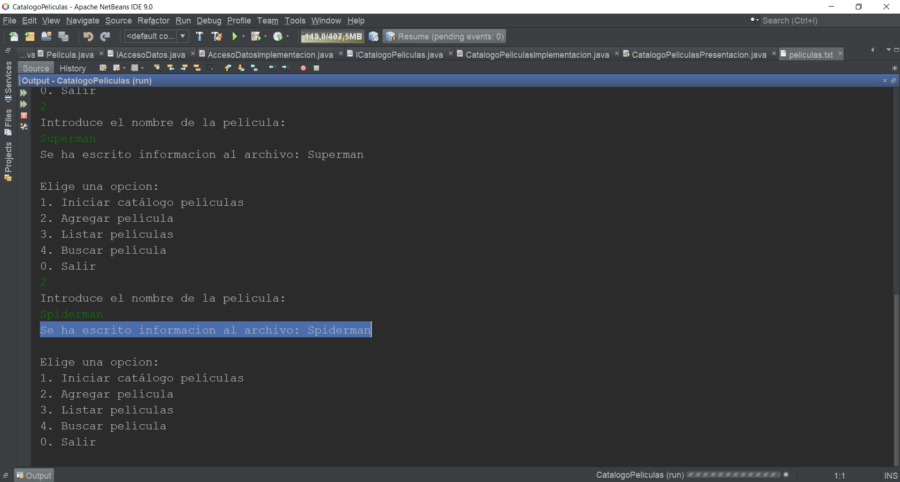
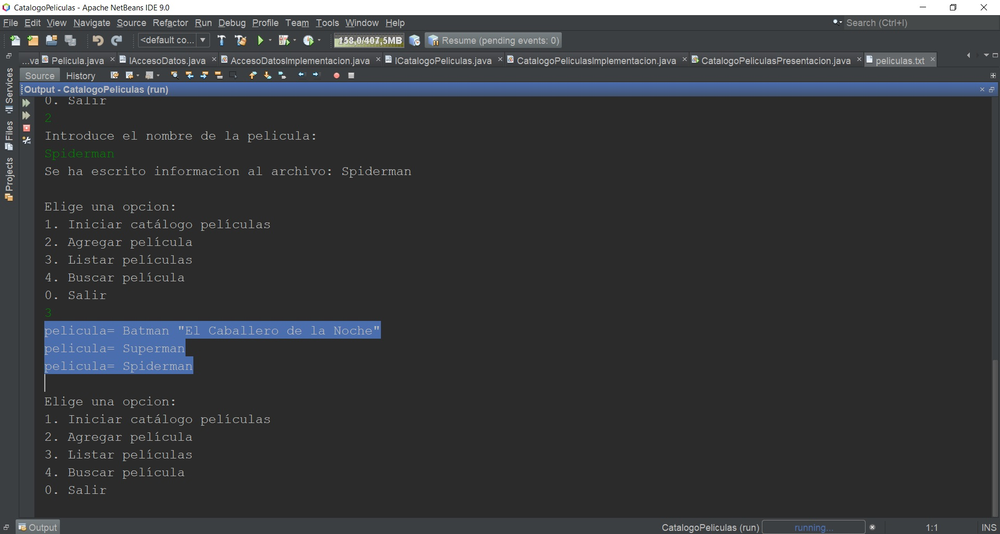
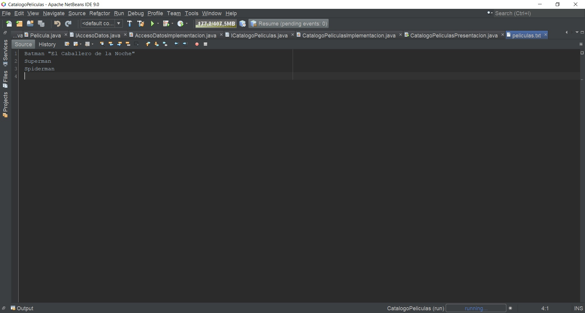
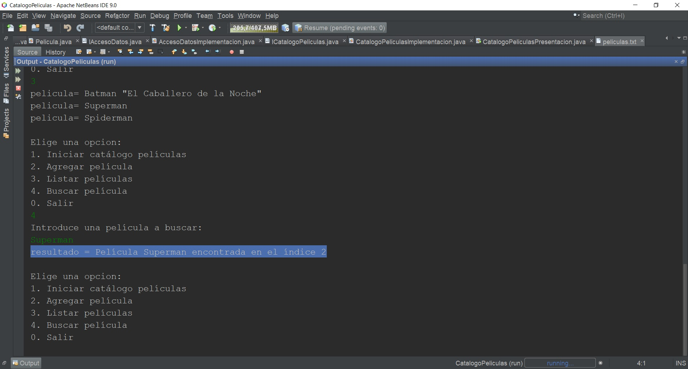
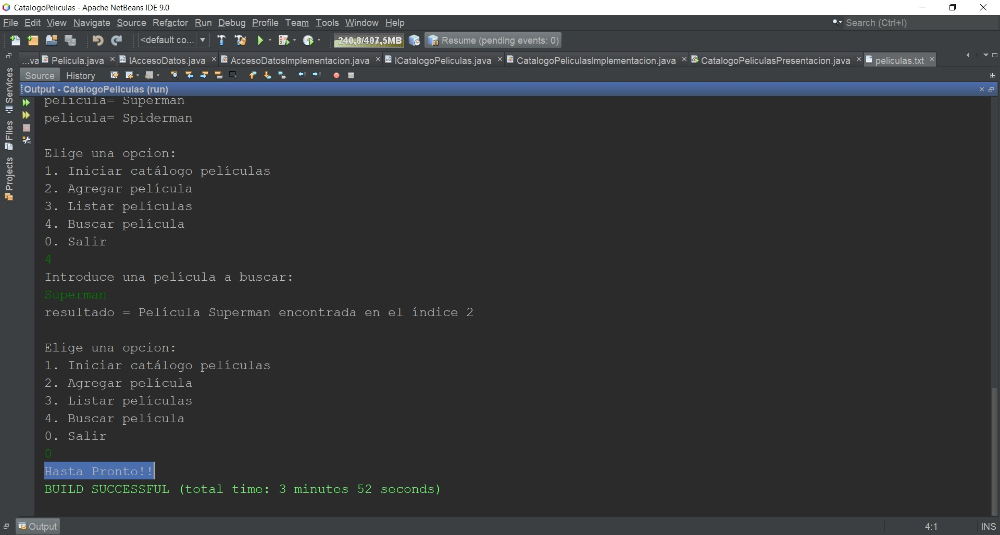

# Catálogo de Películas

_Universidad de Java_

### Inicio

### Creando Archivo txt (Se borra el existente si contiene el mismo nombre)🔧

### Vista del archivo creado📋

### Agregamos películas📋

### Agregamos películas📋

### Agregamos películas📋

### Lista de las películas agregadas📋

## Visualización de películas agregadas en el archivo ⚙️

## Buscar película ⚙️

## Salida del catálogo

## Construido con 🛠️

* [NetBeans](https://netbeans.org/community/releases/82/) - El framework web usado
* [Consola de NetBeans]
* [Java Beans]
* [Excepciones]
* [Interfaces]
* [Herencia]
* [Manejo de Archivos]
* [Código de bajo acoplamiento]
* [Código de alta cohesión]

## Atribuciones 📌
### Profesor Ubaldo Acosta

